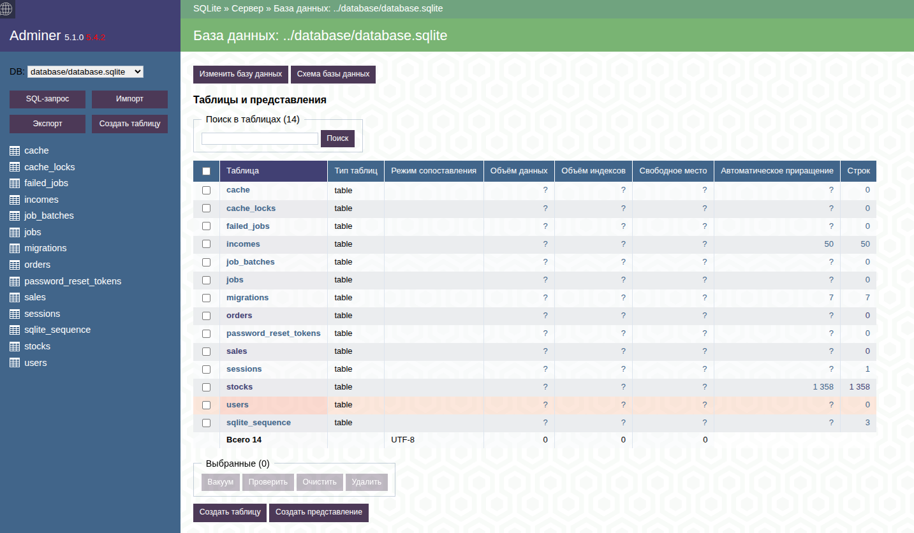

## Тестовое задание для Food ninja

Приложение, которое позволяет пользователям создавать короткие ссылки, отслеживать переходы и управлять своими ссылками через личный кабинет, если зарегистрировался.

## Стэк

*Laravel 13.8
*Filament 5
*Docker Compose 
*Nginx
*PHP 8.3

### Установка и запуск

1. Запустить приложение в docker окружении. Выполните команду в консоли:
```chmod +x ./start.sh && ./start.sh```
2. Откройте в браузере http://localhost:8001

Либо установка и запуск командами в консоли, по-шагово:

1. Выгружаем файлы:
```git clone git@github.com:vamcart/food-ninja.git```
2. Переходим в папку food-ninja:
```cd food-ninja```
3. Собираем и запускаем контейнеры через Docker Compose:
```sudo docker compose up -d --build```
4. Подключаемся в контейнер приложения:
```sudo docker exec -it laravel-app-php /bin/sh```
5. Устанавливаем зависимости:
```composer install```
6. Копируем .env файл:
```cp .env.example .env```
7. Устанавливаем права доступа 777 на папку storage:
```chmod -R 777 storage```
8. Генерируем laravel ключ:
```php artisan key:generate```
9. Запускаем миграции:
```php artisan migrate```
10. Устанавливаем права доступа 777 на папку database:
```chmod 777 ./database```
11. Устанавливаем права доступа 777 на базу sqlite:
```chmod 777 ./database/database.sqlite```
12. Можно сгенерировать filament пользователя через консоль:
```php artisan make:filament-user```
13. А можно просто открыть http://localhost:8001/ , и пройти регистрацию, нажав sign up for an account - http://localhost:8001/register

## Adminer
Смотрим базу данных через adminer:
```php
http://localhost:8001/sqlite.php
```
Выбираем __database/database.sqlite__
Пароль __12345678__




